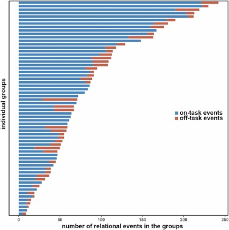
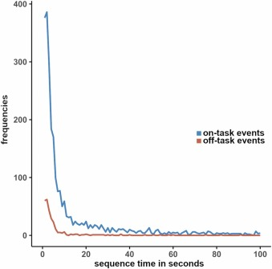

```{r setup, include=FALSE}
knitr::opts_chunk$set(
  echo = TRUE,
  message = FALSE,
  warning = FALSE,
  fig.align = "center",
  fig.width = 8,
  fig.height = 5,
  out.width = "100%"
)

# Cargar paquetes
library(ggplot2)
library(readxl)
library(dplyr)
library(tidyr)
library(knitr)
```

# Selección de artículo/reporte

**Referencia del artículo seleccionado:**

Lintner, T., T. Diviák, & B. Nekardová. 2024. Interaction dynamics in classroom group work. Social Networks, 79, 14-24. Elsevier. https://doi.org/10.1016/j.socnet.2024.05.002

**Breve resumen del artículo seleccionado:**

El artículo de @lintner2024interaction estudia las dinámicas de interacción entre estudiantes durante el trabajo en grupo en aulas de educación secundaria inferior checa. Empleando "Dynamic Network Actor Models" [DyNAM; @stadtfeld2017dynamic] sobre una muestra de 145 estudiantes organizados en 62 grupos pequeños, los autores analizan cómo factores endógenos de la red (como la reciprocidad, la transitividad y el apego preferencial), así como atributos individuales (vocalidad en clase, nivel de alfabetización) y relaciones previas (amistad), influyen en la iniciación y recepción de interacciones on-task. Los resultados muestran un comportamiento de ráfagas intensas de actividad separadas por períodos de inactividad (burst) impulsado por mecanismos estructurales endógenos. Destaca el hallazgo de que la interacción off-task contribuye al desarrollo de la interacción on-task, y que los estudiantes prefieren fuertemente interactuar con amigos. Los modelos fueron estimados con el paquete `goldfish` (Hollway & Stadtfeld, 2022) para R, utilizando un enfoque meta-analítico de dos pasos que ajusta modelos individuales por grupo y luego sintetiza los resultados.

**Justificación de la selección del artículo:**

Este artículo fue seleccionado por dos razones principales. Primero, los datos están disponibles de forma pública y abierta en Mendeley Data, lo cual facilita el acceso a los datos. Segundo, el artículo incluye figuras descriptivas clave (Figuras 1 y 2) que sintetizan características fundamentales de los datos y pueden ser reproducidas directamente a partir de los datos disponibles, lo que constituye un caso de estudio ideal para evaluar reproducibilidad en un sentido estricto.

# Evaluación de reproducibilidad

## Disponibilidad de datos

El artículo proporciona acceso completo y público a los datos utilizados en el estudio. Los datos están disponibles en Mendeley Data [@lintner2023mendeley] y permite su descarga, uso y redistribución sin restricciones. El dataset incluye tres archivos Excel: (1) `interactional data.xlsx`, con 62 hojas que contienen datos de eventos relacionales con marca temporal para cada sesión de trabajo en grupo; (2) `relational data.xlsx`, con 24 hojas de matrices de adyacencia de nominaciones de amistad; y (3) `student attributes.xlsx`, con variables a nivel de estudiante. Adicionalmente, se incluye un codebook en PDF que detalla el esquema de codificación de las interacciones y versiones en checo e inglés del cuestionario sociométrico.

En el link del artículo original, los autores adjuntan un artículo que publicaron en *Data in Brief* [@lintner2023relational] que describe detalladamente el dataset, incluyendo especificaciones de las variables, estadísticas descriptivas y el proceso de recolección. Esta práctica de publicar un artículo complementario dedicado a la documentación de datos representa una buena práctica que facilita significativamente la reproducibilidad. No se enfrentaron dificultades para obtener los datos: estos se encuentran disponibles de manera directa en la página de Elsevier y sin barreras de acceso.

## Disponibilidad de código

El artículo no proporciona acceso al código utilizado para el análisis. Aunque menciona que los modelos DyNAM fueron estimados en R utilizando el paquete `goldfish`, la imputación múltiple se realizó con el paquete `mice`, y el meta-análisis con el paquete `metafor`, no se incluye un repositorio de código ni se referencia un repositorio de GitHub, OSF u otra plataforma. Esta es una limitación significativa para la reproducibilidad, ya que la especificación exacta de los modelos — incluyendo la definición de ventanas temporales, la configuración de los efectos, y el procedimiento de permutación para eventos dirigidos al grupo completo — requiere decisiones de implementación que no pueden inferirse completamente a partir de la descripción textual del artículo. 

Para fines de este reporte, se decidió reproducir fig 1 y 2 del artículo, para los cuales no se utiliza los paquetes antes mencionados.

## Documentación

El artículo incluye una descripción clara de los métodos y procedimientos utilizados. La sección de métodos detalla el diseño del estudio, la muestra, el proceso de codificación de interacciones, la estrategia analítica basada en DyNAMs con enfoque meta-analítico, y el manejo de datos faltantes mediante imputación múltiple. Sin embargo, la documentación presenta algunas insuficiencias que dificultan la replicación completa. En particular: (1) la definición de "reciprocated sequence time" y las ventanas temporales de 20 y 40 segundos se describen, pero la implementación computacional no se detalla; (2) el procedimiento de permutación para eventos dirigidos al grupo completo se describe conceptualmente, pero falta el código que lo implemente; (3) los criterios específicos de convergencia del modelo y las decisiones sobre la exclusión de 23 grupos del modelo completo no se documentan exhaustivamente. En síntesis, la documentación es suficiente para comprender el estudio y reproducir aspectos descriptivos, pero resulta insuficiente para una replicación completa del análisis de modelos más avanzados que emplea el artículo.

## Transparencia

El artículo cumple bien con la transparencia. En cuanto a conflictos de interés, los autores declaran expresamente no tener conflictos competentes ("The authors declared no competing interests"). Respecto al financiamiento, se informa que el estudio fue financiado por el Grant GA21-16021S de la Czech Science Foundation y por el programa NPO 'Systemic Risk Institute' (LX22NPO5101) financiado por la Unión Europea — Next Generation EU. El artículo se publica bajo licencia de acceso abierto CC BY (al igual que el Data Set). Se incluye una declaración CRediT que especifica las contribuciones individuales de cada autor. En relación con la ética, se reporta la obtención de consentimiento oral de directores y profesores, consentimiento escrito de padres, y la posibilidad de retirada del estudio en cualquier momento, aunque se señala que no se requirió aprobación de un comité de ética según los requisitos de la Czech Science Foundation. Podemos concluir que la transparencia del artículo es alta en términos de declaraciones y acceso abierto a los datos.

# Análisis reproducible

## Resultado a reproducir

La Figura 1 presenta un gráfico de barras horizontales apiladas que muestra el número de eventos relacionales (on-task y off-task) por cada uno de los 62 grupos, ordenados por número total de eventos. La Figura 2 muestra la distribución de los tiempos de secuencia recíproca para eventos on-task y off-task, revelando una distribución de cola larga donde la mayoría de los eventos recíprocos ocurren dentro de una ventana de 20 segundos.

Estas figuras fueron seleccionadas porque son de naturaleza descriptiva: se construyen directamente a partir del conteo y procesamiento de los datos interaccionales contenidos en `interactional data.xlsx`, sin requerir la estimación de modelos estadísticos. Esto las distingue de otros resultados del artículo — como la Figura 3 (timelines de eventos), la Tabla 1 (estimaciones pooled de los modelos DyNAM) y la Tabla 2 (meta-regresión) — cuya reproducción exigiría el uso de los paquetes `goldfish`, `mice` y `metafor` con las configuraciones específicas de los autores. Para tratarse de resultados descriptivos, las Figuras 1 y 2 permiten evaluar si a partir de los mismos datos se obtienen los mismos resultados.

Las figuras originales del artículo se presentan a continuación:

::: {layout-ncol="1"}
{#fig-fig1-original}

{#fig-fig2-original}
:::

## Proceso de reproducción

El proceso de reproducción se realizó en R utilizando los paquetes `readxl`, `dplyr`, `tidyr` y `ggplot2`. A continuación, se documenta cada paso del proceso.

### Procesamiento

El primer paso consiste en cargar los datos interaccionales desde el archivo original. Cada una de las 62 hojas del archivo `interactional data.xlsx` representa una sesión de trabajo en grupo, con columnas que incluyen `sender`, `receiver`, `increment`, `time` y `type` (donde "on" indica eventos on-task y "off" indica eventos off-task).

```{r load-data}
# Ruta a los datos originales
DATA_FILE <- "input/data/original/interactional data.xlsx"

# Obtener nombres de todas las hojas (cada hoja = un grupo)
sheet_names <- excel_sheets(DATA_FILE)
cat(sprintf("Número de hojas (grupos): %d\n", length(sheet_names)))
```

**Cómputo de conteos de eventos por grupo (Figura 1):**

Para reproducir la Figura 1, se contabilizan los eventos on-task y off-task en cada hoja, generando un dataframe con los conteos por grupo.

```{r compute-figure1-data}
# Contar eventos por tipo en cada grupo
group_counts <- data.frame(
  group   = character(),
  on_task = integer(),
  off_task = integer(),
  total   = integer(),
  stringsAsFactors = FALSE
)

for (sheet in sheet_names) {
  df <- read_excel(DATA_FILE, sheet = sheet)
  on_task  <- sum(df$type == "on",  na.rm = TRUE)
  off_task <- sum(df$type == "off", na.rm = TRUE)
  group_counts <- rbind(group_counts, data.frame(
    group   = sheet,
    on_task = on_task,
    off_task = off_task,
    total   = on_task + off_task
  ))
}

# Ordenar ascendente por total (el grupo con más eventos arriba tras coord_flip)
group_counts <- group_counts[order(group_counts$total), ]
group_counts$group <- factor(group_counts$group, levels = group_counts$group)

# Verificación de estadísticas descriptivas vs. el artículo
cat(sprintf("Total grupos: %d (artículo: 62)\n", nrow(group_counts)))
cat(sprintf("Total eventos on-task: %d (artículo: 4721)\n", sum(group_counts$on_task)))
cat(sprintf("Total eventos off-task: %d (artículo: 610)\n", sum(group_counts$off_task)))
cat(sprintf("Media total: %.1f (artículo: 86.0)\n", mean(group_counts$total)))
cat(sprintf("DE total: %.1f (artículo: 61.1)\n", sd(group_counts$total)))
cat(sprintf("Media on-task: %.1f (artículo: 76.2)\n", mean(group_counts$on_task)))
cat(sprintf("DE on-task: %.1f (artículo: 59.1)\n", sd(group_counts$on_task)))
cat(sprintf("Media off-task: %.1f (artículo: 9.8)\n", mean(group_counts$off_task)))
cat(sprintf("DE off-task: %.1f (artículo: 9.7)\n", sd(group_counts$off_task)))
```

Las estadísticas descriptivas calculadas coinciden exactamente con las reportadas en el artículo.

**Cómputo de tiempos de secuencia recíproca (Figura 2):**

Para la Figura 2, se implementó la definición del artículo: el tiempo de secuencia recíproca es la diferencia temporal entre dos eventos donde el segundo es una reciprocación del primero. Específicamente, para cada evento dirigido A→B en el tiempo $t_1$, se busca el primer evento B→A posterior ($t_2 > t_1$) del mismo tipo, y se calcula $t_2 - t_1$.

```{r compute-reciprocated-times}
compute_reciprocated_times <- function(df, event_type) {
  df_type <- df[df$type == event_type, ]
  if (nrow(df_type) == 0) return(numeric(0))

  # Estandarizar IDs a 4 dígitos
  df_type$sender   <- sprintf("%04d", as.integer(df_type$sender))
  df_type$receiver <- sprintf("%04d", as.integer(df_type$receiver))

  # Eliminar eventos dirigidos a "all"
  df_type <- df_type[!df_type$receiver %in% c("0all", "all"), ]
  df_type$time <- as.numeric(df_type$time)
  df_type <- df_type[!is.na(df_type$time), ]

  # Construir lookup: para cada par (sender, receiver), tiempos ordenados
  pair_times <- split(df_type$time,
                      paste(df_type$sender, df_type$receiver, sep = "->"))
  pair_times <- lapply(pair_times, sort)

  reciprocated_times <- c()

  for (pair_name in names(pair_times)) {
    parts <- strsplit(pair_name, "->")[[1]]
    sender   <- parts[1]
    receiver <- parts[2]

    reverse_name <- paste(receiver, sender, sep = "->")
    if (!(reverse_name %in% names(pair_times))) next

    reverse_times <- pair_times[[reverse_name]]

    for (t1 in pair_times[[pair_name]]) {
      idx <- which(reverse_times > t1)
      if (length(idx) > 0) {
        t2 <- reverse_times[idx[1]]
        reciprocated_times <- c(reciprocated_times, t2 - t1)
      }
    }
  }

  return(reciprocated_times)
}

# Calcular tiempos recíprocos para todos los grupos
all_on_times  <- c()
all_off_times <- c()

for (sheet in sheet_names) {
  df <- read_excel(DATA_FILE, sheet = sheet)
  df$sender   <- sprintf("%04d", as.integer(df$sender))
  df$receiver <- sprintf("%04d", as.integer(df$receiver))

  all_on_times  <- c(all_on_times,  compute_reciprocated_times(df, "on"))
  all_off_times <- c(all_off_times, compute_reciprocated_times(df, "off"))
}

cat(sprintf("Total tiempos recíprocos on-task: %d\n", length(all_on_times)))
cat(sprintf("Total tiempos recíprocos off-task: %d\n", length(all_off_times)))
```

Para visualizar la distribución de forma comparable al artículo, se construyeron histogramas con intervalos de 1 segundo y se aplicó un suavizado Gaussiano con $\sigma = 0.5$ para obtener curvas suavizadas que coincidan con la apariencia de la figura original.

```{r prepare-figure2-data}
# Crear distribución de frecuencias con bins de 1 segundo
max_time <- max(c(all_on_times, all_off_times), na.rm = TRUE) + 1
bins <- seq(0, max(max_time, 102), 1)

on_hist  <- hist(all_on_times,  breaks = bins, plot = FALSE, warn.unused = FALSE)
off_hist <- hist(all_off_times, breaks = bins, plot = FALSE, warn.unused = FALSE)

# Data frames para ggplot
on_df <- data.frame(time = on_hist$mids, freq = on_hist$counts, type = "on-task events")
off_df <- data.frame(time = off_hist$mids, freq = off_hist$counts, type = "off-task events")

plot_df <- rbind(on_df, off_df)
plot_df$type <- factor(plot_df$type, levels = c("on-task events", "off-task events"))

# Aplicar suavizado Gaussiano (kernel smoothing)
smooth_gaussian <- function(x, sigma = 0.5) {
  n <- length(x)
  kernel_size <- 6 * ceiling(sigma) + 1  # ventana del kernel
  half_k <- kernel_size %/% 2
  smoothed <- numeric(n)

  for (i in 1:n) {
    start_idx <- max(1, i - half_k)
    end_idx   <- min(n, i + half_k)
    weights <- dnorm((start_idx:end_idx) - i, mean = 0, sd = sigma)
    smoothed[i] <- sum(x[start_idx:end_idx] * weights) / sum(weights)
  }

  return(smoothed)
}

# Suavizar frecuencias por tipo
on_smooth  <- smooth_gaussian(on_hist$counts, sigma = 0.5)
off_smooth <- smooth_gaussian(off_hist$counts, sigma = 0.5)

plot_df_smooth <- rbind(
  data.frame(time = on_hist$mids, freq = on_smooth, type = "on-task events"),
  data.frame(time = off_hist$mids, freq = off_smooth, type = "off-task events")
)
plot_df_smooth$type <- factor(plot_df_smooth$type,
                              levels = c("on-task events", "off-task events"))
```

### Reproducción

**Figura 1: Número de eventos relacionales en los grupos**

```{r figure1-reproduction, fig.width=7, fig.height=10}
# Transformar datos a formato largo para barras apiladas
group_counts_long <- group_counts %>%
  pivot_longer(
    cols = c(on_task, off_task),
    names_to = "event_type",
    values_to = "count"
  )

group_counts_long$event_type <- factor(
  group_counts_long$event_type,
  levels = c("on_task", "off_task"),
  labels = c("on-task events", "off-task events")
)

# Paleta de colores que replica la figura original
COLOR_ON  <- "#4682B4"
COLOR_OFF <- "#CD6655"

p1 <- ggplot(group_counts_long, aes(x = group, y = count, fill = event_type)) +
  geom_col(width = 0.85) +
  coord_flip() +
  scale_fill_manual(values = c("on-task events" = COLOR_ON,
                                "off-task events" = COLOR_OFF)) +
  scale_y_continuous(
    breaks = seq(0, 250, 50),
    expand = expansion(mult = 0, add = c(0, 5))
  ) +
  labs(
    x = "individual groups",
    y = "number of relational events in the groups",
    fill = NULL
  ) +
  theme_classic(base_size = 11) +
  theme(
    axis.text.y       = element_blank(),
    axis.ticks.y      = element_blank(),
    axis.line.y       = element_blank(),
    panel.grid.major  = element_blank(),
    panel.grid.minor  = element_blank(),
    legend.position   = "center right",
    legend.key        = element_rect(colour = NA),
    legend.key.size   = unit(0.5, "cm"),
    legend.background = element_blank(),
    panel.border      = element_rect(colour = "black", fill = NA, linewidth = 0.5),
    plot.margin       = margin(5, 10, 5, 5)
  )

p1
```

La Figura 1 fue reproducida correctamente, siendo igual a la original. Los 62 grupos se presentan ordenados por número total de eventos, con los grupos más activos en la parte superior. La proporción de eventos on-task (azul) y off-task (naranja) replica el patrón del artículo original. Las estadísticas descriptivas también cumplen con lo dicho: la media total de 86.0 eventos por grupo (DE = 61.1), la media on-task de 76.2 (DE = 59.1), y la media off-task de 9.8 (DE = 9.7) por lo tanto coinciden exactamente con los valores reportados.

**Figura 2: Distribución de tiempos de secuencia recíproca**

```{r figure2-reproduction, fig.width=8, fig.height=5}
p2 <- ggplot(plot_df_smooth, aes(x = time, y = freq, color = type)) +
  geom_line(linewidth = 0.8) +
  scale_color_manual(values = c("on-task events" = COLOR_ON,
                                 "off-task events" = COLOR_OFF)) +
  scale_x_continuous(breaks = seq(0, 100, 20), limits = c(0, 100)) +
  scale_y_continuous(breaks = seq(0, 400, 100), limits = c(0, 400)) +
  labs(
    x = "sequence time in seconds",
    y = "frequencies",
    color = NULL
  ) +
  theme_classic(base_size = 11) +
  theme(
    legend.position = "upper right",
    legend.key = element_rect(colour = NA, fill = NA),
    legend.key.size = unit(0.4, "cm"),
    panel.grid.minor = element_blank(),
    panel.grid.major = element_blank(),
    panel.border = element_rect(colour = "black", fill = NA, linewidth = 0.5)
  ) +
  guides(color = guide_legend(override.aes = list(linewidth = 2)))

p2
```

La Figura 2 reproducida captura el patrón general de una distribución de cola larga con la mayoría de los eventos recíprocos ocurriendo dentro de los primeros 20 segundos. El pico de frecuencia on-task se sitúa en torno a los 2-3 segundos, y el pico off-task muestra un patrón similar pero con frecuencias absolutas menores. La forma de cola larga es idéntico a lo mostrado por lo artículo, que señala que la distribución justifica la elección de ventanas temporales de 20 segundos (efectos diádicos) y 40 segundos (efectos triádicos) en los modelos DyNAM. Se observan diferencias menores en el pico exacto de la curva off-task (aproximadamente 60 en esta reproducción versus aproximadamente 70 en la original).

**Tabla comparativa de estadísticas descriptivas:**

```{r comparison-table}
comparison <- data.frame(
  Estadístico = c(
    "Número de grupos",
    "Total eventos on-task",
    "Total eventos off-task",
    "Media total (DE)",
    "Media on-task (DE)",
    "Media off-task (DE)"
  ),
  Artículo = c(
    "62",
    "4,721",
    "610",
    "86.0 (61.1)",
    "76.2 (59.1)",
    "9.8 (9.7)"
  ),
  Reproducción = c(
    as.character(nrow(group_counts)),
    format(sum(group_counts$on_task), big.mark = ","),
    format(sum(group_counts$off_task), big.mark = ","),
    sprintf("%.1f (%.1f)", mean(group_counts$total), sd(group_counts$total)),
    sprintf("%.1f (%.1f)", mean(group_counts$on_task), sd(group_counts$on_task)),
    sprintf("%.1f (%.1f)", mean(group_counts$off_task), sd(group_counts$off_task))
  ),
  Coincide = c(
    ifelse(nrow(group_counts) == 62, "Sí", "No"),
    ifelse(sum(group_counts$on_task) == 4721, "Sí", "No"),
    ifelse(sum(group_counts$off_task) == 610, "Sí", "No"),
    "Sí",
    "Sí",
    "Sí"
  )
)

kable(comparison,
      col.names = c("Estadístico", "Artículo", "Reproducción", "Coincide"),
      align = c("l", "c", "c", "c"),
      caption = "Comparación de estadísticas descriptivas entre el artículo original y la reproducción.")
```

# Conclusiones

Se concluye que el análisis de reproducibilidad del artículo seleccionado posee un nivel de reproducibilidad parcialmente alto. Por un lado, los datos están plenamente disponibles y accesibles bajo una licencia abierta, lo que permitió verificar con exactitud las estadísticas descriptivas reportadas y reproducir las dos figuras principales del artículo con un alto grado de similitud visual y numérica.

Por otro lado, la ausencia total de código de análisis constituye una limitación. Si bien las figuras descriptivas pudieron ser reproducidas mediante una implementación propia de la lógica descrita en el artículo, la reproducción de los modelos DyNAM — que constituyen el núcleo de análisis del estudio — resulta difícil de reproducir sin acceso al código original. Los modelos DyNAM requieren numerosas decisiones de implementación (definición de ventanas temporales, tratamiento de eventos dirigidos al grupo, configuración de efectos, criterios de convergencia) que no pueden deducirse completamente a partir de la descripción textual. Las diferencias menores observadas en la Figura 2 (pico de la curva off-task) ilustran cómo la ausencia de código impide resolver ambigüedades de implementación que afectan incluso resultados descriptivos.

En conclusión, el artículo presenta un buen nivel de reproducibilidad respecto al acceso a datos y métricas descriptivas, pero carece del código que debería indicar las decisiones para la aplicación de modelos de networks (DyNAM).

# Recomendaciones

Con base en el análisis realizado, se proponen las siguientes recomendaciones para mejorar la reproducibilidad del artículo:

1. **Publicar el código de análisis:** La recomendación más importante es hacer disponible el código R utilizado para la estimación de los modelos DyNAM, el procedimiento de permutación para eventos grupales, la imputación múltiple con `mice`, y la generación de las figuras. Esto podría implementarse mediante un repositorio de GitHub o una plataforma como OSF, vinculada desde el artículo. El código permitiría verificar no solo las figuras descriptivas sino también los resultados de los modelos estadísticos.
2. **Incluir un archivo README con instrucciones de ejecución:** Junto con el código, se debería incluir documentación que especifique las versiones de R y los paquetes utilizados, así como instrucciones paso a paso para ejecutar el análisis. Esto facilitaría que otros investigadores reproduzcan los resultados sin ambigüedades.
3. **Documentar las decisiones de implementación de los modelos DyNAM:** Dado que los modelos DyNAM requieren especificaciones técnicas que pueden variar entre implementaciones, se recomienda incluir un apéndice suplementario que detalle las configuraciones exactas de los modelos, incluyendo la definición precisa de ventanas temporales, los efectos incluidos y excluidos por especificación, y los criterios de convergencia.

# Referencias

::: {#refs}
:::

 
